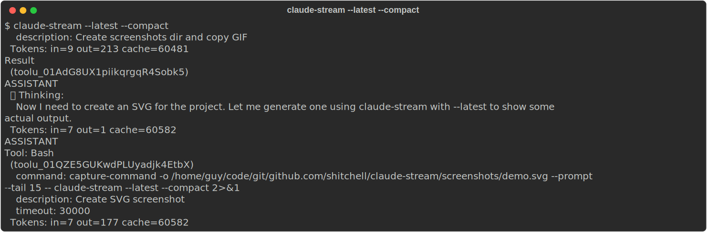
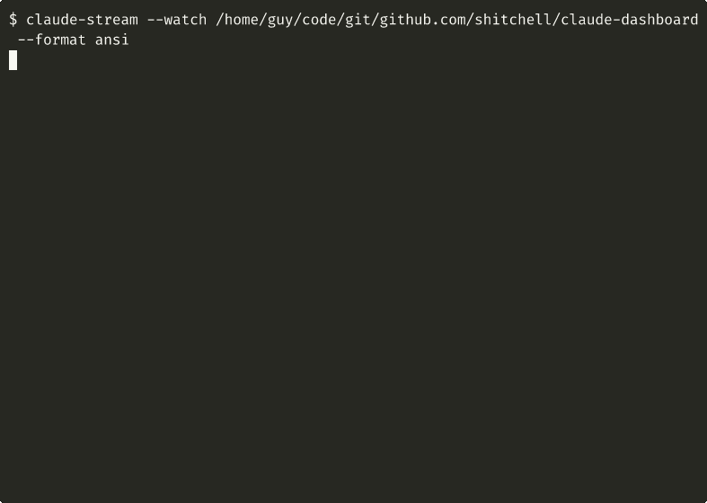

# claude-stream

[](https://pypi.org/project/claude-stream/)

Parse and prettify Claude Code JSONL stream output.



## Installation

```bash
pip install claude-stream
```

For file watching support:

```bash
pip install "claude-stream[watch]"
```

---



## Usage

```bash
# Read from a file
claude-stream session.jsonl

# Show only last N lines
claude-stream session.jsonl -n 20

# Read from stdin
cat session.jsonl | claude-stream

# Parse the most recent session
claude-stream --latest
claude-stream --latest -n 50              # Last 50 lines

# Find and parse a session by UUID
claude-stream --session abc123
```

### Watch Mode

Watch for new messages in real-time (like `tail -f`):

```bash
# Watch all Claude sessions
claude-stream --watch ~/.claude/projects/

# Watch from any project directory (auto-resolves to Claude path)
claude-stream --watch .
claude-stream --watch ~/myproject

# Watch with initial context (last N lines)
claude-stream --watch . -n 10
```

When given a directory outside `~/.claude`, the path is automatically
converted to Claude's project format (e.g., `/home/user/project` becomes
`~/.claude/projects/-home-user-project`).

### Output Formats

```bash
# ANSI terminal colors (default for TTY)
claude-stream session.jsonl

# Markdown
claude-stream --format markdown session.jsonl > export.md

# Plain text (default when piped)
claude-stream session.jsonl | less
```

Output automatically switches to plain text when piped. Use `--format ansi` to force colors.

### Filtering

```bash
# Show only specific message types
claude-stream --show-type assistant --show-type user session.jsonl

# Show only messages with specific tools
claude-stream --show-tool Bash --show-tool Read session.jsonl

# Grep for patterns
claude-stream --grep "error" session.jsonl

# Exclude patterns
claude-stream --exclude "thinking" session.jsonl
```

### Display Options

```bash
# Hide thinking blocks
claude-stream --hide-thinking session.jsonl

# Hide tool results
claude-stream --hide-tool-results session.jsonl

# Show metadata (UUIDs, timestamps)
claude-stream --show-metadata session.jsonl

# Compact mode (hide thinking, tool results, metadata)
claude-stream --compact session.jsonl

# Show line numbers
claude-stream --line-numbers session.jsonl
```

## Architecture

- **Pydantic models** parse JSON into typed message structures
- **Messages** produce `RenderBlock` lists (flexible rendering primitives)
- **Formatters** convert `RenderBlocks` to output formats (ANSI, Markdown, Plain)

## License

[WTFPL](http://www.wtfpl.net/)
